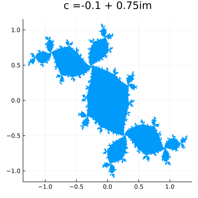

= Read me
qwjyh
v1.0, 2022/06/25

== what's this
充填Julia集合をプロットするJulia script

== example

== note
[source, julia]
----
include::./plotfilledjuliaset.jl[lines=28]
----
`transpose(reduce(hcat, l))` does `l::Vector{Vector{Any}} -> Matrix{Any}`.

cited from https://discourse.julialang.org/t/how-to-convert-vector-of-vectors-to-matrix/72609/4